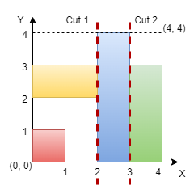

<!-- problem:start -->

# [3394. Check if Grid can be Cut into Sections](https://leetcode.com/problems/check-if-grid-can-be-cut-into-sections)

## Description

<!-- description:start -->

You are given an integer n representing the dimensions of an n x n grid, with the origin at the bottom-left corner of the grid. You are also given a 2D array of coordinates rectangles, where rectangles[i] is in the form [startx, starty, endx, endy], representing a rectangle on the grid. Each rectangle is defined as follows:

(startx, starty): The bottom-left corner of the rectangle.

(endx, endy): The top-right corner of the rectangle.

Note that the rectangles do not overlap. Your task is to determine if it is possible to make either two horizontal or two vertical cuts on the grid such that:

Each of the three resulting sections formed by the cuts contains at least one rectangle.

Every rectangle belongs to exactly one section.

Return true if such cuts can be made; otherwise, return false.

 

Example 1:

Input: n = 5, rectangles = [[1,0,5,2],[0,2,2,4],[3,2,5,3],[0,4,4,5]]

Output: true

Explanation:

The grid is shown in the diagram. We can make horizontal cuts at y = 2 and y = 4. Hence, output is true.

Example 2:

Input: n = 4, rectangles = [[0,0,1,1],[2,0,3,4],[0,2,2,3],[3,0,4,3]]

Output: true

Explanation:

We can make vertical cuts at x = 2 and x = 3. Hence, output is true.

Example 3:

Input: n = 4, rectangles = [[0,2,2,4],[1,0,3,2],[2,2,3,4],[3,0,4,2],[3,2,4,4]]

Output: false

Explanation:

We cannot make two horizontal or two vertical cuts that satisfy the conditions. Hence, output is false.

 

Constraints:

3 <= n <= 10^9

3 <= rectangles.length <= 10^5

0 <= rectangles[i][0] < rectangles[i][2] <= n

0 <= rectangles[i][1] < rectangles[i][3] <= n

No two rectangles overlap.

<!-- description:end -->
